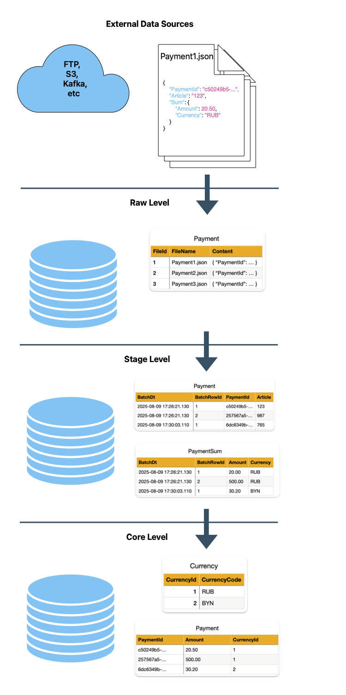

# Coding4Fun.Etl

## Overview

This project is intended to simplify the process of regularly copying data from one Microsoft SQL Server to another. Developer will write ETL as thought a source database and a target database are located on a single server, but in fact they works on different servers.

### Database architecture

Before we will go into technical details lets explain a data lifetime.



**External Data Source** contains data from different sources, such as: FTP, S3, DFS, Kafka, etc.
They can hold information in different formats, such as xml, json, yml, xlsx, etc.
We have to download it as is into the **Raw Level** without parsing and any transformations.

Example of single row from the Raw Level:
```json
{
    "PaymentId": "c50249b5-e315-47d2-bebc-f4b13e3efe5e",
    "Article": "123",
    "Sum": {
        "Amount": 20.50,
        "Currency": "RUB"
    }
}
```

Then we have to deserialize our structured message to different raw tables without any transformation, but only with adding columns for references between tables.

We have a module, that regularly executing: filling a batch from the Raw Level, automatically transforming it (xml, csv, json) to tables with adding two columns, that are unique identify the row in the target table. They are: date-time of the batch (BatchDt), and row number inside this batch (BatchRowId).  

Example of table Payment in the Stage Level:
```
| BatchDt                 | BatchRowId | PaymentId                            | Article |
| 2025-08-09 17:26:21.130 | 1          | c50249b5-e315-47d2-bebc-f4b13e3efe5e | 123     |
| 2025-08-09 17:26:21.130 | 2          | 257567a5-dd6b-450e-89b9-2b0f34e1df21 | 987     |
| 2025-08-09 17:30:03.110 | 1          | 6dc6349b-c927-45e4-ab2f-b73e9ff11962 | 765     |
```

Example of table PaymentSum in the Stage Level:
```
| BatchDt                 | BatchRowId | Amount | Currency |
| 2025-08-09 17:26:21.130 | 1          | 20.50  | RUB      |
| 2025-08-09 17:26:21.130 | 2          | 500.00 | RUB      |
| 2025-08-09 17:30:03.110 | 1          | 30.20  | BYN      |
```

Notice, that we have 2 batches: the first one was executed at 17:26:21 and has two rows, and the last batch was executed at 17:30:03 and has one row.

As result in the Stage Level we hold parsed data, but not normalized. We normalize it in the **Core Level**.

Example of the table Currency:
```
| CurrencyId | CurrencyCode |
| 1          | RUB          |
| 2          | BYN          |
```

Example of the table Payment:
```
| PaymentId                            | Amount | CurrencyId |
| c50249b5-e315-47d2-bebc-f4b13e3efe5e | 20.50  | 1          |
| 257567a5-dd6b-450e-89b9-2b0f34e1df21 | 500.00 | 1          |
| 6dc6349b-c927-45e4-ab2f-b73e9ff11962 | 30.20  | 2          |
```

Usually Stage Level and Core live on different servers. We must regularly load batches of data from the Stage, load it into Core data and transform it.
This process has name ELT (Extract-Load-Transform). For a long time we have using a SSIS to do it. But it has some disadvantages:
1. Each ELT process we have to design manually, this is very time-consuming.
2. As was mentioned in the previous sentence, this process is written manually by an data-engineer and SSIS-package exists as a XML-file, that has dozens lines of code. Code review of this file is also very time-consuming and not easy.

So, we have to load batch of data from the Stage server to the Core server, then transform it and save.

This project is intended to create an abstraction, that allow us to think that our databases on the Stage and the Core work on the same server, but in fact, they located on different servers (something like linked servers).

Lets look at a procedure, that will load data from the Stage, normalize it and save to Core level:
```
CREATE PROCEDURE dbo.MergePayment
AS
BEGIN
	-- C4F.ETL.MainTable:stage.Payment
	-- C4F.ETL.BatchSize:1005

    -- Filling dictionary of currencies.
	INSERT INTO dbo.Currency (IsoCode)
	SELECT Currency
	FROM StageDb.stage.Payment
	EXCEPT
	SELECT IsoCode
	FROM dbo.Currency;

    -- Filling Payment using dictionary of currencies.
	MERGE dbo.Payment AS Target
	USING (SELECT Payment.PaymentId,
				  Payment.Amount,
				  Currency.CurrencyId,
				  ModifyDt = Payment.BatchDt
		   FROM StageDb.stage.Payment AS Payment
		   INNER JOIN dbo.Currency ON Currency.IsoCode = Payment.Currency) AS Source
	ON Source.PaymentId = Target.PaymentId
	WHEN NOT MATCHED THEN INSERT (
		   PaymentId
		  ,Amount
		  ,CurrencyId
		  ,ModifyDt)
	VALUES (Source.PaymentId, Source.Amount, Source.CurrencyId, Source.ModifyDt)
	WHEN MATCHED AND Target.ModifyDt < Source.ModifyDt
	THEN UPDATE SET Target.Amount = Source.Amount,
					Target.CurrencyId = Source.CurrencyId;
END
```

This procedure under the hood will be transformed to this presentation:
```
	-- C4F.ETL.MainTable:stage.Payment
	-- C4F.ETL.BatchSize:1005

    -- Filling dictionary of currencies.
	INSERT INTO dbo.Currency (IsoCode)
	SELECT Currency
	FROM #Payment -- StageDb.stage.Payment is replaced with #Payment that is automatically filling with a batch from Stage server
	EXCEPT
	SELECT IsoCode
	FROM dbo.Currency;

    -- Filling Payment using dictionary of currencies.
	MERGE dbo.Payment AS Target
	USING (SELECT Payment.PaymentId,
				  Payment.Amount,
				  Currency.CurrencyId,
				  ModifyDt = Payment.BatchDt
		   FROM #Payment AS Payment -- StageDb.stage.Payment is replaced with #Payment that is automatically filling with a batch from Stage server
		   INNER JOIN dbo.Currency ON Currency.IsoCode = Payment.Currency) AS Source
	ON Source.PaymentId = Target.PaymentId
	WHEN NOT MATCHED THEN INSERT (
		   PaymentId
		  ,Amount
		  ,CurrencyId
		  ,ModifyDt)
	VALUES (Source.PaymentId, Source.Amount, Source.CurrencyId, Source.ModifyDt)
	WHEN MATCHED AND Target.ModifyDt < Source.ModifyDt
	THEN UPDATE SET Target.Amount = Source.Amount,
					Target.CurrencyId = Source.CurrencyId;
```

## How to use this project


First of all, database projects of Stage (Stage.sqlproj) and Core (Core.sqlproj) have to be created with [SDK-style](https://learn.microsoft.com/en-us/sql/tools/sql-database-projects/tutorials/create-deploy-sql-project?view=sql-server-ver17&pivots=sq1-visual-studio-sdk).

1. Using [SqlPackage](https://learn.microsoft.com/en-us/sql/tools/sqlpackage/sqlpackage?view=sql-server-ver17) we generate migration script between two releases and publish it to the Stage Server.

2. Release of the Stage database (dacpac) we deploy to our private (corporate) NuGet repository. For developing purpose we can add NuGet repository on a local computer based on any directory. [An example](https://learn.microsoft.com/en-us/dotnet/core/tools/dotnet-nuget-add-source):
```
> dotnet nuget add source c:\packages --name TestRepository
```

For deploying release to the NuGet repository we must execute:

```
> dotnet nuget push Stage.nuget --source TestRepository
```

3. Include Stage package with dacpac to the Core project using private NuGet repository.
```
<?xml version="1.0" encoding="utf-8"?>
<Project DefaultTargets="Build">
  <Sdk Name="Microsoft.Build.Sql" Version="1.0.0" />
  <PropertyGroup>
    <Name>CoreDb</Name>
  </PropertyGroup>
  <!-- Add the following lines -->
  <ItemGroup>
    <SqlCmdVariable Include="StageDb">
      <Value>$(StageDb)</Value>
      <DefaultValue>StageDb</DefaultValue>
    </SqlCmdVariable>
  </ItemGroup>
  <ItemGroup>
    <PackageReference Include="StageDb">
      <SuppressMissingDependenciesErrors>False</SuppressMissingDependenciesErrors>
      <DatabaseSqlCmdVariable>StageDb</DatabaseSqlCmdVariable>
      <Version>1.0.0</Version>
    </PackageReference>
  </ItemGroup>
</Project>
```

4. Include `Coding4Fun.Etl.Build` to the Core project from the public NuGet repository.
```
<?xml version="1.0" encoding="utf-8"?>
<Project DefaultTargets="Build">
  <Sdk Name="Microsoft.Build.Sql" Version="1.0.0" />
  <PropertyGroup>
    <Name>CoreDb</Name>
  </PropertyGroup>
  
  <ItemGroup>
    <SqlCmdVariable Include="StageDb">
      <Value>$(StageDb)</Value>
      <DefaultValue>StageDb</DefaultValue>
    </SqlCmdVariable>
  </ItemGroup>
  <ItemGroup>
    <PackageReference Include="StageDb">
      <SuppressMissingDependenciesErrors>False</SuppressMissingDependenciesErrors>
      <DatabaseSqlCmdVariable>StageDb</DatabaseSqlCmdVariable>
      <Version>1.0.0</Version>
    </PackageReference>
	<!-- Add the following line -->
	<PackageReference Include="Coding4Fun.Sql.Build" />
  </ItemGroup>
</Project>
```

5. Build your Core project and publish it to the server using SqlPackage.

6. During the build of Core project the library `Coding4Fun.Etl.Build` is emitting configurations for EtlLauncher. You can explain them. They contain information about source tables and ETL. An example of configuration file: [MergePayment.json](https://github.com/scrappyCoco/Etl/blob/main/test/TestData/Expected/MergePayment.json).

7. Create a job, that will periodically run EtlLauncher. You must pass generated config to it and connection string of the Stage and Core databases.

```
> .\EtlLauncher.exe --pipeline-config path-to-generated-config.json `
                    --source-connection-string "Server=.;Database=Stage;User ID=sa;Password=pa$$"`
					--target-connection-string "Server=.;Database=Stage;User ID=sa;Password=pa$$"
```

<!--
```
<?xml version="1.0" encoding="utf-8"?>
<Project DefaultTargets="Build">
  <Sdk Name="Microsoft.Build.Sql" Version="1.0.0" />
  <PropertyGroup>
    <Name>CoreDb</Name>
    <DSP>Microsoft.Data.Tools.Schema.Sql.Sql160DatabaseSchemaProvider</DSP>
    <ModelCollation>1033, CI</ModelCollation>
    <ProjectGuid>{00000000-0000-0000-0000-000000000000}</ProjectGuid>
    <C4FEtlGeneratorSourceDacPacPath>$(MSBuildProjectDirectory)/../StageDb/bin/$(Configuration)/StageDb.dacpac</C4FEtlGeneratorSourceDacPacPath>
    <C4FEtlGeneratorTargetDacPacPath>$(SqlTargetPath)</C4FEtlGeneratorTargetDacPacPath>
  </PropertyGroup>
  <ItemGroup>
    <SqlCmdVariable Include="StageDb">
      <Value>$(StageDb)</Value>
      <DefaultValue>StageDb</DefaultValue>
    </SqlCmdVariable>
  </ItemGroup>
  <ItemGroup>
    <PackageReference Include="StageDb">
      <SuppressMissingDependenciesErrors>False</SuppressMissingDependenciesErrors>
      <DatabaseSqlCmdVariable>StageDb</DatabaseSqlCmdVariable>
      <Version>1.0.0</Version>
    </PackageReference>
    <PackageReference Include="Coding4Fun.Sql.Build" />
  </ItemGroup>
</Project>
```
-->

### Try it easy yourself

1. [Install SqlPackage](https://learn.microsoft.com/en-us/sql/tools/sqlpackage/sqlpackage-download?view=sql-server-ver17#installation-cross-platform):
```
> dotnet tool install -g microsoft.sqlpackage
```

1. [Install SqlCmd](https://learn.microsoft.com/en-us/sql/tools/sqlcmd/sqlcmd-download-install?view=sql-server-ver17&tabs=mac#download-and-install-sqlcmd-go)

2. Install SQL Server in Docker:
```
> docker run -e "ACCEPT_EULA=Y" -e "MSSQL_SA_PASSWORD=3J5*Y/,Ym/_&VJ3@" -p 1433:1433 -d mcr.microsoft.com/mssql/server:2022-latest
```

3. Build StageDb on your local computer:
```
> dotnet build test/TestData/StageDb/StageDb.sqlproj
```

4. Deploy StageDb to the Docker container:
```
> SqlPackage /Action:Publish \
             /SourceFile:"test/TestData/StageDb/bin/Debug/StageDb.dacpac" \
             /TargetConnectionString:"Server=.;User ID=sa;password=3J5*Y/,Ym/_&VJ3@;Database=StageDb;TrustServerCertificate=True;"
```

5. Fill tables in StageDb with data sample:
```
> sqlcmd -S localhost -U sa -P "3J5*Y/,Ym/_&VJ3@" -d StageDb -i test/TestData/FillWithSampleData.sql
```

6. Build CoreDb:
```
> dotnet build test/TestData/CoreDb/CoreDb.sqlproj
```

7. Deploy CoreDb to the Docker container:
```
> SqlPackage /Action:Publish \
             /SourceFile:"test/TestData/CoreDb/bin/Debug/CoreDb.dacpac" \
             /TargetConnectionString:"Server=.;User ID=sa;password=3J5*Y/,Ym/_&VJ3@;Database=CoreDb;TrustServerCertificate=True;" \
             /Variables:StageDb=StageDb
```

8. Run EtlLauncher:
```
> src/EtlLauncher/bin/Debug/net8.0/Coding4Fun.Etl.EtlLauncher \
  --pipeline-config /Users/artemkorsunov/RiderProjects/Etl/test/TestData/CoreDb/bin/Debug/Etl/MergePayment.json \
  --source-connection-string "Server=.;User ID=sa;password=3J5*Y/,Ym/_&VJ3@;Database=StageDb;TrustServerCertificate=True;" \
  --target-connection-string "Server=.;User ID=sa;password=3J5*Y/,Ym/_&VJ3@;Database=CoreDb;TrustServerCertificate=True;"
```